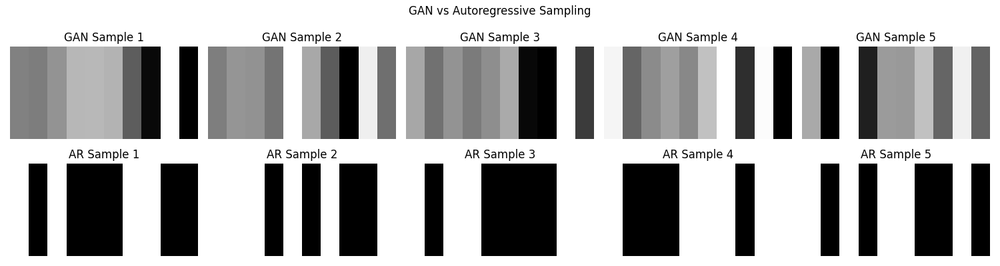

# GAN vs Autoregressive Sampling: A Comparative Study

## Overview
This mini-project investigates **how sampling behavior differs between a GAN (Generative Adversarial Network)** and an **Autoregressive (AR) model** when generating sequences. It focuses on understanding where randomness is injected during sampling and how it impacts the **diversity** and **sharpness** of the generated samples.

We conducted simple experiments by training a tiny GAN generator and a tiny Autoregressive model on synthetic data, sampling from both, and visualizing the results.

---

## Research Question

**"How does sampling from a GAN (via latent noise) compare to sampling from an autoregressive model (via sequential token prediction) in terms of generation diversity?"**

---

## Models

### 1. GAN Generator
- **Architecture:** Simple feedforward MLP.
- **Input:** Random latent vector \( z \sim \mathcal{N}(0,1) \).
- **Output:** Full sequence (length 10) generated in **one shot**.
- **Sampling:** Diversity comes from sampling different latent vectors \( z \).

### 2. Autoregressive Model
- **Architecture:** GRU (Gated Recurrent Unit) followed by a linear output layer.
- **Input:** Starts from a fixed token (e.g., 0).
- **Output:** Predicts one token at a time sequentially.
- **Sampling:** Diversity comes from **random sampling at each step**.

---

## Sampling Process

- **GAN Sampling:**
  1. Sample a random \( z \) once.
  2. Generate the full sequence immediately.

- **Autoregressive Sampling:**
  1. Predict the next token given previous tokens.
  2. Inject randomness at every step (sampling from predicted probabilities).

---

## Results

Below is the visualization (attached `plot.png`):

```plaintext

```

- **Top Row (GAN Samples):**
  - Smooth variations.
  - Gray-scale transitions.
  - Reflect global noise injected once.

- **Bottom Row (AR Samples):**
  - Sharp black and white patterns.
  - Only binary values (0 or 1).
  - Randomness accumulates step-by-step.

---

## Interpretation

| Aspect | GAN | Autoregressive |
|:------:|:---:|:--------------:|
| Randomness injection | Once globally (latent \( z \)) | Step-by-step (token-by-token) |
| Diversity | Global variability | Local variability at each token |
| Smoothness | High (continuous values) | Low (binary sharpness) |
| Generation style | Whole sequence at once | Sequential prediction |

- **GAN** models produce sequences that look globally smooth because the entire sequence is conditioned on one random vector.
- **Autoregressive** models generate more abrupt, discrete outputs because randomness is added at every generation step independently.

---

## Discussion

This experiment provides a clear demonstration of two fundamentally different modes of generative modeling. GAN-based sampling reflects a holistic approach to generation, where a single latent vector \( z \) dictates the entire output. This leads to globally coherent structures but may sometimes limit local variability within a sequence. In contrast, autoregressive models offer fine-grained control over generation at every step, resulting in high local variability but with potential challenges in maintaining global coherence over longer sequences.

The importance of this question lies in its relevance to **the design and evaluation of generative models** in many modern applications. For tasks such as **video prediction, scene generation, or sequential decision-making**, it is critical to understand where randomness is introduced and how it propagates through the model. The ability to balance **global structure** with **local diversity** directly impacts the **quality**, **stability**, and **generalization** capabilities of the generated outputs.

Additionally, the source of randomness impacts how models handle uncertainty: GANs incorporate uncertainty globally, whereas autoregressive models accumulate uncertainty progressively. This distinction becomes even more significant when scaling up to complex datasets like videos, where maintaining consistency across time steps (frames) is crucial.

Overall, this project shows that the choice between GANs and autoregressive models should be guided by the specific trade-off between **global coherence** and **local flexibility** needed for the target task. Understanding this difference is essential for developing more reliable, scalable, and interpretable generative models.

---

## Files

- `sampling.py` : Full training and sampling code.
- `plot.png` : Visualization comparing GAN and AR samples.

---

*Author: [Your Name]*

